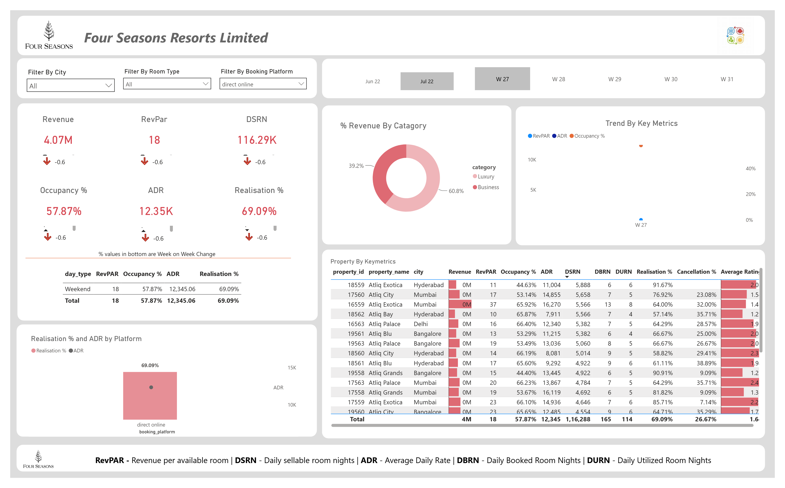
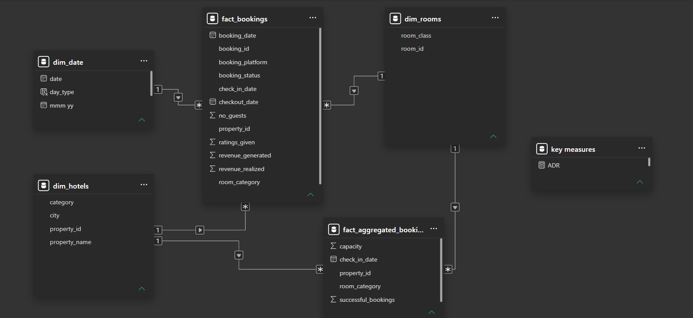

# Hotel-Revenue-Analytics-Dashboard

##📌 Project Overview

Developed an end-to-end Power BI dashboard to analyze hotel revenue, occupancy, booking trends, and operational KPIs. The project uses a star-schema data model, DAX measures, and interactive visualizations to help stakeholders monitor hotel performance and support data-driven decision-making.

---

## 🛠️ Tools & Technologies

- Power BI
- DAX
- Power Query
- Microsoft Excel
- Kaggle Dataset

---

## 📊 Dashboard Preview

---

## 🗄️ Data Model

The dashboard follows a **Star Schema** consisting of fact and dimension tables.

### Fact Tables
- fact_bookings
- fact_aggregated_bookings

### Dimension Tables
- dim_date
- dim_hotels
- dim_rooms

---

## 📈 Key Performance Indicators (KPIs)

- Revenue
- RevPAR
- ADR
- Occupancy %
- Realisation %
- Cancellation %
- No Show Rate %
- Average Rating
- DBRN
- DSRN
- DURN
- Total Bookings

---

## 📐 DAX Measures

Implemented **20+ DAX measures** to calculate business KPIs and performance metrics, including:

- Revenue
- RevPAR
- ADR
- Occupancy %
- Realisation %
- Cancellation %
- No Show Rate %
- Average Rating
- Revenue WoW Change %
- Occupancy WoW Change %
- ADR WoW Change %
- DSRN WoW Change %
- Realisation WoW Change %

- ## ⭐ Dashboard Features

- Executive KPI Cards
- Dynamic Filters
- Weekly Trend Analysis
- Revenue Analysis
- Booking Platform Analysis
- Property-wise Performance
- Room Category Analysis
- Interactive Tables
- Conditional Formatting
- Drill-down Analysis
